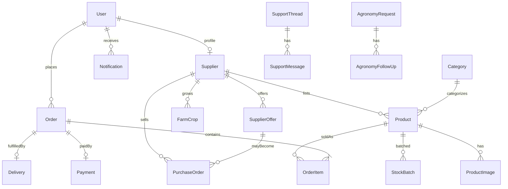

# Youth Huza — System Architecture Report

Living documentation for maintainers. Last updated: **2026-07-21**.

Interactive canvas (Cursor): `canvases/system-architecture-report.canvas.tsx` in the Cursor project folder.

**Workflow diagrams (training / expo / manuals):** [system-workflows/README.md](./system-workflows/README.md)

---

## 1. Portal connections

```text
                    ┌─────────────────┐
                    │  Public Entry   │
                    │       /         │
                    └────────┬────────┘
               ┌─────────────┴─────────────┐
               ▼                           ▼
      ┌────────────────┐          ┌────────────────┐
      │  HUZA FRESH    │          │ Farmers Portal │
      │ /shop …        │          │ /farmer …      │
      │ (customers)    │          │ (HUZA GROW)    │
      └────────┬───────┘          └────────┬───────┘
               │  Orders / MoMo             │ Produce / offers / dossier
               └─────────────┬─────────────┘
                             ▼
                    ┌─────────────────┐
                    │  Admin Portal   │
                    │ /admin …        │
                    │ (+ warehouse,   │
                    │  delivery)      │
                    └────────┬────────┘
                             ▼
                    ┌─────────────────┐
                    │   PostgreSQL    │
                    │  (Prisma ORM)   │
                    └─────────────────┘
```

| Surface | Path | Purpose |
|--------|------|---------|
| Public Entry | `/` | Brand landing; CTAs to shop and farmer apply |
| HUZA FRESH | `/shop`, `/products`, `/cart`, `/checkout`, `/account`, `/track` | Customer marketplace |
| Farmers Portal | `/farmer`, `/farmer/dashboard`, … | Farmer onboarding + workspace |
| Admin Portal | `/admin/*` | Ops: orders, catalog, farmers, procurement, finance |
| Warehouse | `/warehouse` | Receiving / stock actions (role-gated) |
| Delivery | `/delivery-portal` | Driver delivery updates |

**Catalog live rule:** products appear on HUZA FRESH when `isActive` and at least one **STOREFRONT** image exist (after admin approval or procurement QC).

---

## 2. Database ERD (core)

52 models in `prisma/schema.prisma`. Core relations:



**Key enums:** `Role`, `SupplierStatus`, `OrderStatus`, `FulfillmentMethod` (PICKUP | HOME_DELIVERY), `PaymentMethod`, `PaymentStatus`, `FarmingType`, `ProcurementDealType`, `PurchaseOrderStatus`.

---

## 3. API endpoints and UI callers

**69** route files under `src/app/api`.

### Auth & account

| Endpoint | Methods | Used by |
|----------|---------|---------|
| `/api/auth/*` | GET, POST | NextAuth (all portals) |
| `/api/auth/register` | POST | Customer register; `FarmerRegisterForm` |
| `/api/auth/forgot-password` | POST | Forgot-password page |
| `/api/auth/reset-password` | POST | Reset-password page |
| `/api/auth/change-password` | POST | Change-password page |
| `/api/account/profile` | PATCH | `AccountActions` |
| `/api/account/password` | POST | `AccountActions` |
| `/api/account/addresses` | POST, PATCH, DELETE | `AccountActions`; checkout address step |

### HUZA FRESH commerce

| Endpoint | Methods | Used by |
|----------|---------|---------|
| `/api/cart` | GET, PUT, DELETE | `cart-store` |
| `/api/wishlist` | GET, POST, DELETE | `ProductCard`, `Header` |
| `/api/orders` | POST | `CheckoutClient` |
| `/api/orders/track` | GET | `/track` |
| `/api/payments/status` | GET, POST | `CheckoutClient`; admin confirm |
| `/api/payments/callback/mtn` | POST | MTN webhook (no UI) |
| `/api/promotions/validate` | POST | `CheckoutClient` |
| `/api/receipts/[orderNumber]` | GET | Checkout, track, account, admin |
| `/api/invoices/[orderNumber]` | GET | Same |
| `/api/reviews` | POST | `ProductReviewForm` |
| `/api/restock-requests` | POST | `ProductDetailClient` |
| `/api/products/recent` | GET | `RecentlyViewedSection` |
| `/api/search/suggest` | GET | `SmartSearch` |
| `/api/geo` | GET | `DeliveryAddressStep` |

### Public / support / infra

| Endpoint | Methods | Used by |
|----------|---------|---------|
| `/api/public/settings` | GET | `Providers`, `Footer`, contact |
| `/api/contact` | POST | Contact page |
| `/api/support` | GET, POST | `SupportChat` (requires access token) |
| `/api/support/tickets` | GET, POST | `SupportCenterClient` |
| `/api/newsletter` | POST | *No UI caller* |
| `/api/faq` | GET | *No UI caller* (static FAQ) |
| `/api/uploads` | POST | Farmer dossier; admin products |
| `/api/health` | GET | Ops |
| `/api/jobs/process` | GET, POST | Cron + `JOBS_SECRET` |

### Farmers Portal (`/api/supplier/*`)

| Endpoint | Methods | Used by |
|----------|---------|---------|
| `/api/supplier/products` | GET, POST | `FarmerPortalClient` |
| `/api/supplier/products/[id]` | PATCH | `FarmerPortalClient`, `FarmerMyCropsPanel` |
| `/api/supplier/profile` | PATCH | `FarmerDossierForm` |
| `/api/supplier/crops` | GET, POST, PATCH | `FarmerCropsClient` |
| `/api/supplier/agronomy` | GET, POST | `FarmerAgronomyClient` |
| `/api/supplier/offers` | GET, POST | Legacy supplier client |
| `/api/supplier/pos` | GET, PATCH | Legacy supplier client |
| `/api/supplier/orders` | PATCH | *No UI caller* |

### Admin & staff

| Endpoint | Methods | Used by |
|----------|---------|---------|
| `/api/admin/live` | GET | `AdminShell`, dashboard |
| `/api/admin/search` | GET | Command palette |
| `/api/admin/notifications` | PATCH | `AdminShell` |
| `/api/admin/orders` | GET, PATCH | `AdminOrdersClient` |
| `/api/admin/customers` | GET, PATCH | `AdminCustomersClient` |
| `/api/admin/payments` | GET, PATCH | `AdminPaymentsClient` |
| `/api/admin/support` | GET, PATCH | `AdminSupportClient` |
| `/api/admin/categories` | GET, POST, PATCH | Categories admin |
| `/api/admin/products` | GET, POST, PATCH | Products, approvals, inventory |
| `/api/admin/promotions` | CRUD | Promotions admin |
| `/api/admin/inventory` | GET | Inventory admin |
| `/api/admin/restock-requests` | GET, PATCH | Restock admin |
| `/api/admin/deliveries` | GET, PATCH | Deliveries admin |
| `/api/admin/suppliers` | GET, PATCH | Farmers admin |
| `/api/admin/agronomy` | GET, PATCH | Agronomy admin |
| `/api/admin/crops` | GET | Crops admin |
| `/api/admin/photography` | GET | Photography queue |
| `/api/admin/procurement` | GET, POST, PATCH | Procurement admin |
| `/api/admin/market-purchases` | GET, POST, PATCH | Market buy |
| `/api/admin/purchase-records/[n]` | GET | Internal PDF |
| `/api/admin/reports` | GET | Reports admin |
| `/api/admin/reviews` | PATCH | Reviews moderation |
| `/api/admin/settings` | GET, PATCH | Settings (Super Admin write) |
| `/api/admin/users` | GET, POST, PATCH | Staff management |
| `/api/admin/audit` | GET | Audit log |
| `/api/admin/security/totp` | GET, POST | 2FA setup |
| `/api/admin/hours` | POST | Business hours |
| `/api/warehouse` | POST, PATCH | `WarehouseClient` |
| `/api/delivery-portal` | GET, PATCH | `DeliveryPortalClient` |
| `/api/procurement/messages` | GET, POST | Staff ↔ farmer messages |

---

## 4. Role–permission matrix

| Role | Pages | Capabilities | System settings / staff / audit |
|------|-------|--------------|----------------------------------|
| **Super Admin** | Full `/admin/*` | All mutations incl. payments | Yes |
| **Huza Employee** (see below) | Module-gated `/admin` (+ warehouse / delivery) | Per `ADMIN_ROLE_MODULES` | No |
| **Farmer (`SUPPLIER`)** | `/farmer/*` workspace | Produce, crops, agronomy, view POs/payments | No |
| **Customer** | Storefront, checkout, account, track | Orders, addresses, reviews | No |

### Employee roles

| Role | Typical modules | Mutate customer payments |
|------|-----------------|--------------------------|
| ADMIN / MANAGER | All ops except settings/staff/audit/security/hours | Yes |
| PROCUREMENT | Farmers, approvals, PO, market, photography cluster | No |
| FINANCE | Orders, payments, reports, farmer payouts | Yes |
| INVENTORY | Catalog, inventory, restock, approvals | No |
| WAREHOUSE | Inventory + `/warehouse` | No |
| SUPPORT | Orders, customers, support (payments read) | No |
| DELIVERY | `/delivery-portal` only | No |

**Guards:** middleware for page prefixes; `requireAdminSession` / `requirePortalSession` for APIs (blocks `mustChangePassword`). Farmer sell routes require supplier `APPROVED`.

---

## 5. Feature completion checklist

| Feature | Status | Notes |
|---------|--------|-------|
| Public entry + marketing | **Complete** | |
| HUZA FRESH catalog & cart | **Complete** | |
| Checkout pickup / home delivery | **Complete** | Manual MoMo pay-in when provider keys absent |
| MTN / Airtel live collection | **Partial** | Implemented; production often manual |
| Card payment | **Planned** | Enum + copy only |
| COD | **Planned** | Explicitly unavailable |
| Farmer register → approve → sell | **Complete** | Conventional (STANDARD) signup |
| Organic registration path | **Partial** | Schema/UI; signup forced STANDARD |
| Product approvals → live shop | **Complete** | |
| Procurement / market buy | **Complete** | `/admin/procurement` |
| Admin RBAC | **Complete** | |
| Farmer i18n | **Partial** | Strong on nav/sell/sales; some panels EN |
| Customer checkout i18n | **Partial** | |
| Admin i18n | **Planned** | English staff UI |
| Support chat + tickets | **Complete** | Token-protected chat |
| Admin + farmer reports | **Complete** | |
| Newsletter / FAQ APIs | **Partial** | Little or no UI wiring |

---

## Naming debt (intentional)

- Farmer UI: `/farmer` · Farmer APIs: `/api/supplier/*`
- `/supplier` → `/farmer`
- `/procurement` → `/admin/procurement`

Update this file when adding portals, roles, payment providers, or major API groups.
