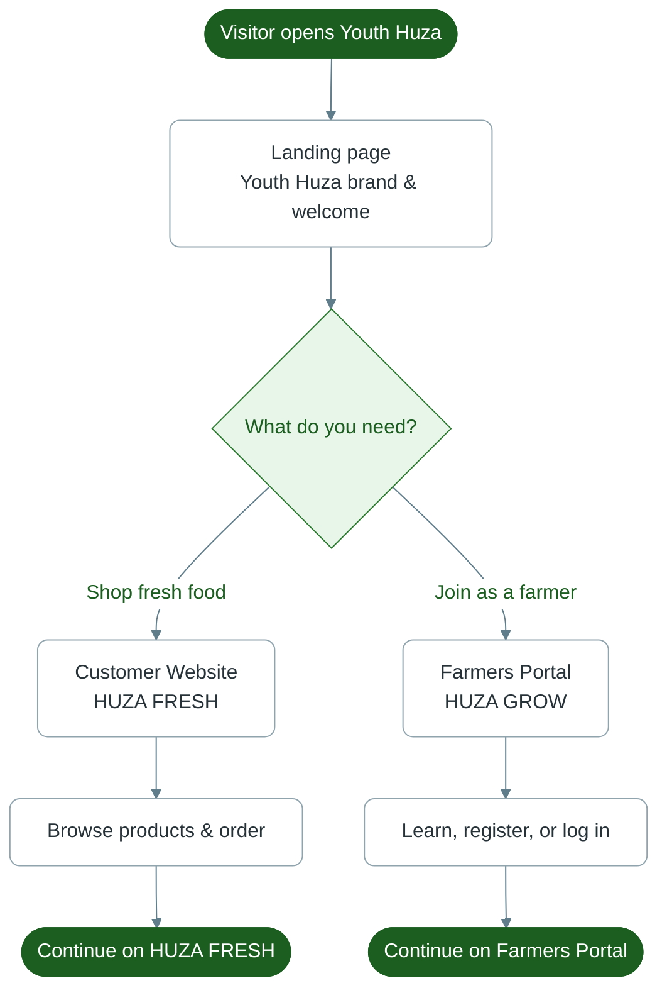

# Diagram 1 — Public Entry Page

How visitors first enter the Youth Huza platform.

**Portal:** Public Entry (`youthhuza.rw` home)

---

---

## In plain words

1. Anyone opens the **Youth Huza** landing page.
2. They choose **Customer Website** (buy food) or **Farmers Portal** (partner / sell harvest).
3. The site sends them to the chosen portal.

No account is required to view the landing page.
