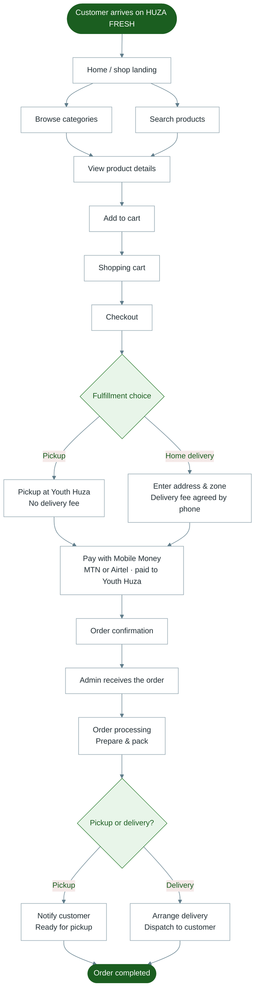

# Diagram 2 — Customer Website (HUZA FRESH)

Complete customer shopping journey, as implemented today.

**Portal:** Customer Website · Payment: Mobile Money to Youth Huza (often confirmed by staff when live bank APIs are not connected)

---

---

## Notes for trainers

- Products on the website are those **approved** and published by Youth Huza (with official shop photos).
- **Pickup** is free; **home delivery** fee is confirmed with the customer by phone (not a fixed online fee).
- Guests can check out; registered customers can also manage orders in their account.
