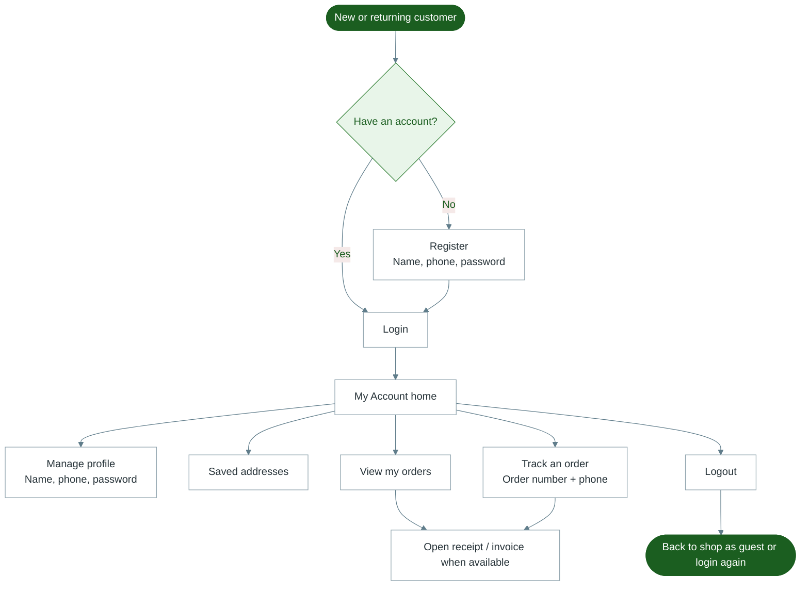

# Diagram 3 — Customer Account

How a customer creates and uses their HUZA FRESH account.

---

---

## Notes for trainers

- Tracking can also be done from the public **Track order** page without opening the full account.
- Wishlist and cart sync when the customer is logged in.
