```mermaid
%%{init: {'theme':'base', 'themeVariables': { 'fontFamily':'arial', 'primaryColor':'#E8F5E9', 'primaryTextColor':'#1B5E20', 'primaryBorderColor':'#2E7D32', 'lineColor':'#607D8B'}}}%%
flowchart TB
  A([Staff login]) --> B[Dashboard<br/>Live overview & alerts]

  B --> C[Orders]
  B --> D[Customers]
  B --> E[Products & categories]
  B --> F[Inventory & restock]
  B --> G[Deliveries]
  B --> H[Farmers & approvals]
  B --> I[Procurement]
  B --> J[Payments]
  B --> K[Support]
  B --> L[Reports]
  B --> M[Settings<br/>Super Admin]

  C --> C1[Confirm payment · prepare · ready for pickup/dispatch]
  D --> D1[View customer · notes · activity]
  E --> E1[List · edit · publish · promotions]
  F --> F1[Stock levels · adjustments · restock requests]
  G --> G1[Assign · update delivery status]
  H --> H1[Approve farmers · crop reviews · agronomy · photos]
  I --> I1[Buy harvest · market purchase · farmer payouts]
  J --> J1[Verify customer Mobile Money payments]
  K --> K1[Chat & tickets]
  L --> L1[Sales · payments · farmers · inventory reports]
  M --> M1[Staff · hours · security · system options]

  classDef start fill:#1B5E20,color:#FFFFFF,stroke:#1B5E20
  classDef hub fill:#E8F5E9,color:#1B5E20,stroke:#2E7D32
  classDef box fill:#FFFFFF,color:#263238,stroke:#90A4AE
  classDef detail fill:#ECEFF1,color:#37474F,stroke:#90A4AE

  class A start
  class B hub
  class C,D,E,F,G,H,I,J,K,L,M box
  class C1,D1,E1,F1,G1,H1,I1,J1,K1,L1,M1 detail
```

# Diagram 4 — Admin Portal

How Youth Huza staff move through the Admin Portal after login.

**Who:** Super Admin, Managers, and role-based employees (Procurement, Finance, Inventory, Support, etc.)

---

---

## How modules connect

| From | Connects to |
|------|-------------|
| Orders | Payments, Deliveries, Inventory (stock out) |
| Farmers & Approvals | Products on website, Procurement |
| Procurement | Inventory, Products on website, Farmer payments |
| Inventory | Products, Orders |
| Reports | Data from orders, payments, farmers, stock |

**Important:** Not every employee sees every module. Access depends on their job role (see [Role Permissions](./13-role-permissions.md)).
