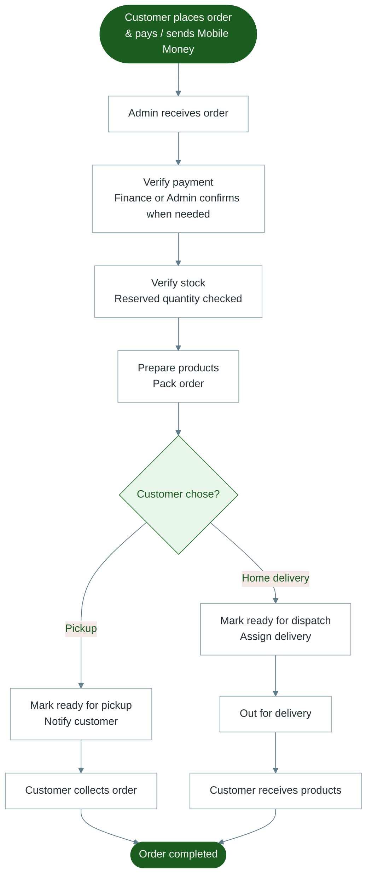

# Diagram 5 — Order Processing

From customer order to completion (ops view).

---

---

## Status path (simple)

Pending → Paid / Confirmed → Preparing → Packed → Ready for pickup **or** Ready for dispatch → Out for delivery → Delivered
