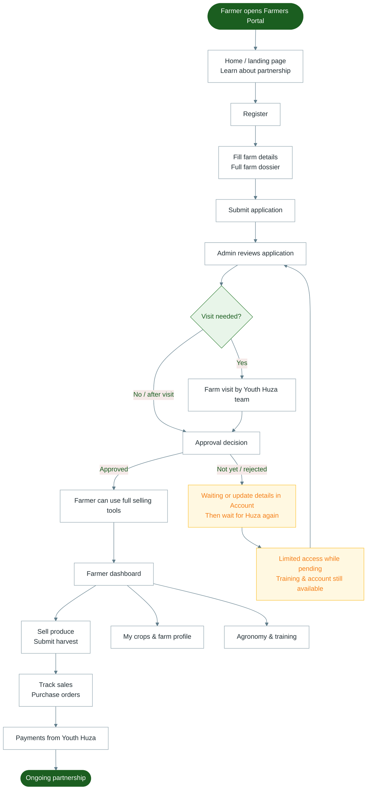

# Diagram 6 — Farmers Portal (HUZA GROW)

Complete farmer journey from first visit to selling and getting paid.

---

---

## Notes for trainers

- New farmers register on the **conventional partner** path (standard farming). Organic fields may exist for older accounts.
- Login uses **phone + last 4 digits of National ID**.
- Selling (submit harvest, sales, reports) unlocks after the farm account is **Approved**.
