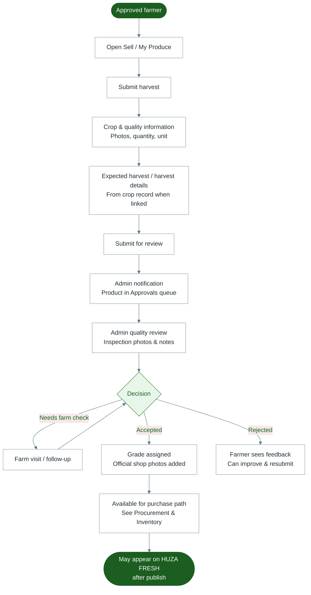

# Diagram 7 — Produce Submission

How a farmer submits harvest for Youth Huza to review (direct sell path).

---

---

## Notes for trainers

- Farmers do **not** set the final shop price alone; Youth Huza inspects and agrees commercial terms.
- Deal type (direct buy vs commission) is set by Huza operations on the purchase order—not chosen as two separate buttons by the farmer.
- Related flow: [Procurement](./08-procurement.md).
