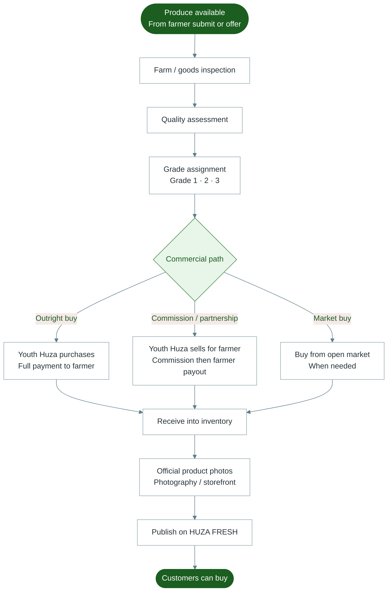

# Diagram 8 — Procurement

How Youth Huza turns accepted harvest into inventory and website products.

---

---

## Notes for trainers

- Procurement tools live under **Admin → Procurement** (and related farmer / photography screens).
- Market purchase is used when Huza buys outside a registered farmer offer.
- Farmer sees buy orders and payments in **Sales** on the Farmers Portal.
