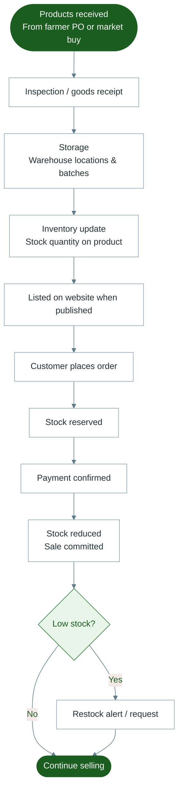

# Diagram 9 — Inventory

How stock moves from receipt to customer sales.

---

---

## Notes for trainers

- Staff use **Admin → Inventory** and the **Warehouse** tools for receiving and adjustments.
- Customers may request restock interest on out-of-stock products; staff see those requests in Admin.
