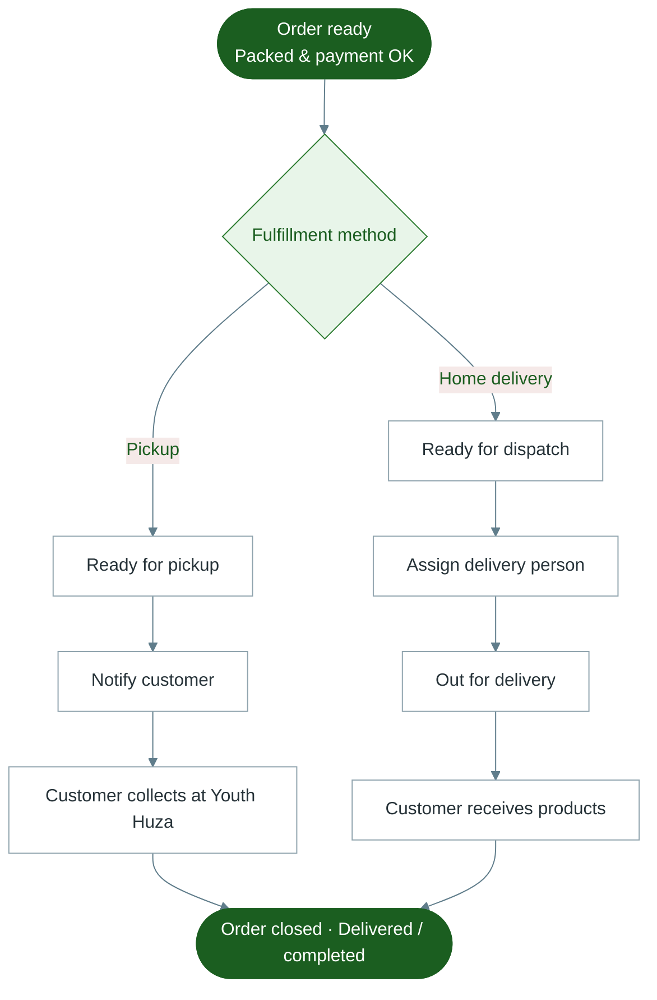

# Diagram 10 — Delivery & Pickup

How fulfilled orders reach the customer.

---

---

## Notes for trainers

- Delivery staff use the **Delivery Portal**; managers also manage deliveries in Admin.
- Home delivery fee and timing are confirmed with the customer (often by phone), not as a fixed online calculator.
