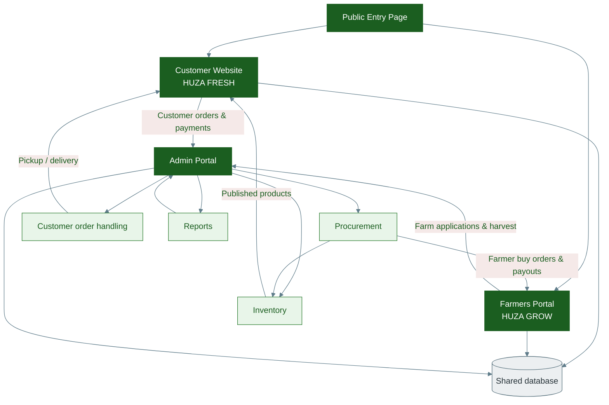

# Diagram 11 — System Connections

Master view: how every major part of Youth Huza connects.

---

---

## Data flow in one sentence

Farmers and customers use their portals; **Admin** runs procurement, inventory, and orders; everything is stored in one **database**; approved products return to the **customer website**.
