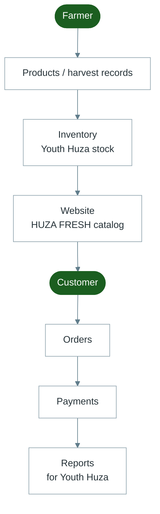

# Diagram 12 — Database Flow

Simple story of how data moves (for non-technical training).  
This is **not** a full technical database schema — see the [Architecture Report](../SYSTEM_ARCHITECTURE.md) for that.

---

---

## Remember

Every arrow above is handled inside the same Youth Huza system — farmers do not upload directly to a separate shop database.
