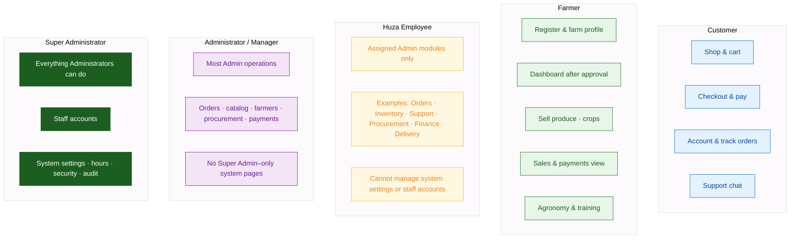

# Diagram 13 — Role Permissions

Who can use which parts of the platform.

---

---

## Quick matrix

| Area | Customer | Farmer | Huza Employee | Administrator | Super Admin |
|------|:--------:|:------:|:-------------:|:-------------:|:-----------:|
| HUZA FRESH shop | Yes | — | — | — | — |
| Farmers Portal workspace | — | Yes | — | —* | —* |
| Admin orders / catalog | — | — | If assigned | Yes | Yes |
| Procurement | — | View own sales | If assigned | Yes | Yes |
| Staff & system settings | — | — | No | No | Yes |
| Delivery portal | — | — | Delivery role | Yes | Yes |

\*Staff may open farmer tools only in special cases (e.g. linked test profiles); day-to-day farmers use `/farmer`.

Employee job titles in the system include: Manager, Procurement, Finance, Inventory, Warehouse, Support, Delivery — each with a different module list.
